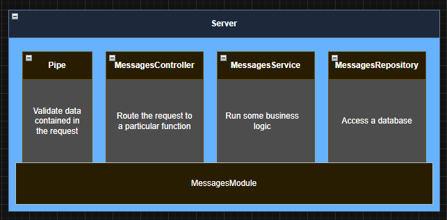
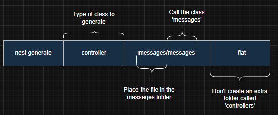

<p align="center">
  <a href="http://nestjs.com/" target="blank"></a>
</p>

[circleci-image]: https://img.shields.io/circleci/build/github/nestjs/nest/master?token=abc123def456
[circleci-url]: https://circleci.com/gh/nestjs/nest

  <p align="center">A progressive <a href="http://nodejs.org" target="_blank">Node.js</a> framework for building efficient and scalable server-side applications.</p>
    <p align="center">
<a href="https://www.npmjs.com/~nestjscore" target="_blank"></a>
<a href="https://www.npmjs.com/~nestjscore" target="_blank"></a>
<a href="https://www.npmjs.com/~nestjscore" target="_blank"></a>
<a href="https://circleci.com/gh/nestjs/nest" target="_blank"></a>
<a href="https://discord.gg/G7Qnnhy" target="_blank"></a>
<a href="https://opencollective.com/nest#backer" target="_blank"></a>
<a href="https://opencollective.com/nest#sponsor" target="_blank"></a>
  <a href="https://paypal.me/kamilmysliwiec" target="_blank"></a>
    <a href="https://opencollective.com/nest#sponsor"  target="_blank"></a>
  <a href="https://twitter.com/nestframework" target="_blank"></a>
</p>
  <!--[](https://opencollective.com/nest#backer)
  [](https://opencollective.com/nest#sponsor)-->

## Learning Notes

[Learning Notes](https://github.com/fireballdev99/learn-nestjs-basic-message/tree/main/learning-note) My learning note lecture is here

## Description

[Nest](https://github.com/nestjs/nest) framework TypeScript starter repository.

## Project setup

```bash
$ npm install
```

## Compile and run the project

```bash
# development
$ npm run start

# watch mode
$ npm run start:dev

# production mode
$ npm run start:prod
```

## Run tests

```bash
# unit tests
$ npm run test

# e2e tests
$ npm run test:e2e

# test coverage
$ npm run test:cov
```

## Deployment

When you're ready to deploy your NestJS application to production, there are some key steps you can take to ensure it runs as efficiently as possible. Check out the [deployment documentation](https://docs.nestjs.com/deployment) for more information.

If you are looking for a cloud-based platform to deploy your NestJS application, check out [Mau](https://mau.nestjs.com), our official platform for deploying NestJS applications on AWS. Mau makes deployment straightforward and fast, requiring just a few simple steps:

```bash
$ npm install -g @nestjs/mau
$ mau deploy
```

With Mau, you can deploy your application in just a few clicks, allowing you to focus on building features rather than managing infrastructure.

## Resources

Check out a few resources that may come in handy when working with NestJS:

- Visit the [NestJS Documentation](https://docs.nestjs.com) to learn more about the framework.
- For questions and support, please visit our [Discord channel](https://discord.gg/G7Qnnhy).
- To dive deeper and get more hands-on experience, check out our official video [courses](https://courses.nestjs.com/).
- Deploy your application to AWS with the help of [NestJS Mau](https://mau.nestjs.com) in just a few clicks.
- Visualize your application graph and interact with the NestJS application in real-time using [NestJS Devtools](https://devtools.nestjs.com).
- Need help with your project (part-time to full-time)? Check out our official [enterprise support](https://enterprise.nestjs.com).
- To stay in the loop and get updates, follow us on [X](https://x.com/nestframework) and [LinkedIn](https://linkedin.com/company/nestjs).
- Looking for a job, or have a job to offer? Check out our official [Jobs board](https://jobs.nestjs.com).

## Support

Nest is an MIT-licensed open source project. It can grow thanks to the sponsors and support by the amazing backers. If you'd like to join them, please [read more here](https://docs.nestjs.com/support).

## Stay in touch

- Author - [Kamil Myśliwiec](https://twitter.com/kammysliwiec)
- Website - [https://nestjs.com](https://nestjs.com/)
- Twitter - [@nestframework](https://twitter.com/nestframework)

## License

Nest is [MIT licensed](https://github.com/nestjs/nest/blob/master/LICENSE).

## My Notes

## The Basic of Nest

## การทำงานของ Server ปกติ


## NestJS จะมีตัวช่วยพิเศษคือ


## Pipe

- ช่วย Validate ข้อมูลที่เข้ามาจาก Request

## Guard

- จะช่วยเรื่อง Request ที่เข้ามาจาก User ที่ได้ทำการ Authenticate หรือ Authorized เพื่อเข้าใช้ Application

## Controller

- เหมือนเป็น Routing logic

## Service

- จัดการเกี่ยวกับ Business Logic

## Repository

- จัดการเกี่ยวกับ Database ตรงตัวเลย Access a database

## And these is other tools of NestJS


## Controller and Module are required to make the most simple, basic app

# Basic main.ts Files


## เราจะแยก AppController และ AppModule ออกจาก main.ts ดังนี้


## โดยจะมีชื่อ Specific ตามภาพด้านบน

### ปกติเราจะตั้งชื่อตาม ชื่อส่วนหน้าของ Controller หรือ Module เช่น

- class AppController {} เราจะตั้งชื่อไฟล์ว่า app.controller.ts

### Filename template: name.type_of_thing.ts

## NestJS CLI generate notes

### I will use appropriate name for all functions like this image



```bash
# for this project use messages
# Module
$ nest generate module messages

# Controller
$ nest generate controller messages/messages --flat
# หลังจาก run คำสั่ง Controller cli 
#จะทำการ update messges.module.ts เพื่อใช้ controller ให้เลยอัตโนมัติ
```



### อธิบายภาพด้านบนเพิ่มเติม
- ในส่วนของ messages อันแรก คือให้มันอยู่ใน folder messages
- ส่วนที่ 2 ของ messages (หลัง / ) คือชื่อของ class เราใส่ messages ไปเราจะได้ messages.controller.ts 
- สรุปคือถ้าเขียนเป็น messages/test จะได้ test.controller.ts ที่อยู่ใน /messages นั่นเอง
- ส่วน --flat ก็ตามภาพเลยไม่สร้าง folder เพิ่มที่ชื่อ Controller