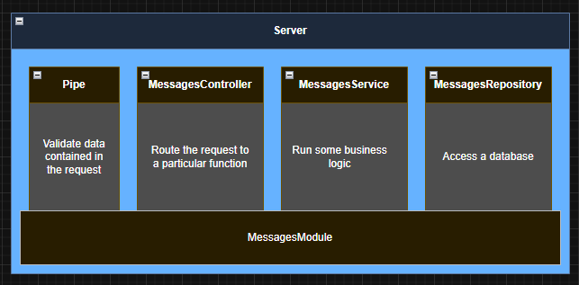
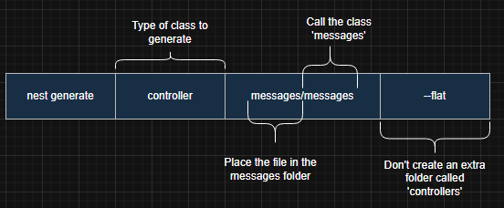

# Nest Cli Notes

> nest cli command to generate module easier

### I will use appropriate name for all functions like this image



```bash
# for this project use messages
# Module
$ nest generate module messages

# Controller
$ nest generate controller messages/messages --flat
# หลังจาก run คำสั่ง Controller cli 
#จะทำการ update messges.module.ts เพื่อใช้ controller ให้เลยอัตโนมัติ
```



### อธิบายภาพด้านบนเพิ่มเติม
- ในส่วนของ messages อันแรก คือให้มันอยู่ใน folder messages
- ส่วนที่ 2 ของ messages (หลัง / ) คือชื่อของ class เราใส่ messages ไปเราจะได้ messages.controller.ts 
- สรุปคือถ้าเขียนเป็น messages/test จะได้ test.controller.ts ที่อยู่ใน /messages นั่นเอง
- ส่วน --flat ก็ตามภาพเลยไม่สร้าง folder เพิ่มที่ชื่อ Controller